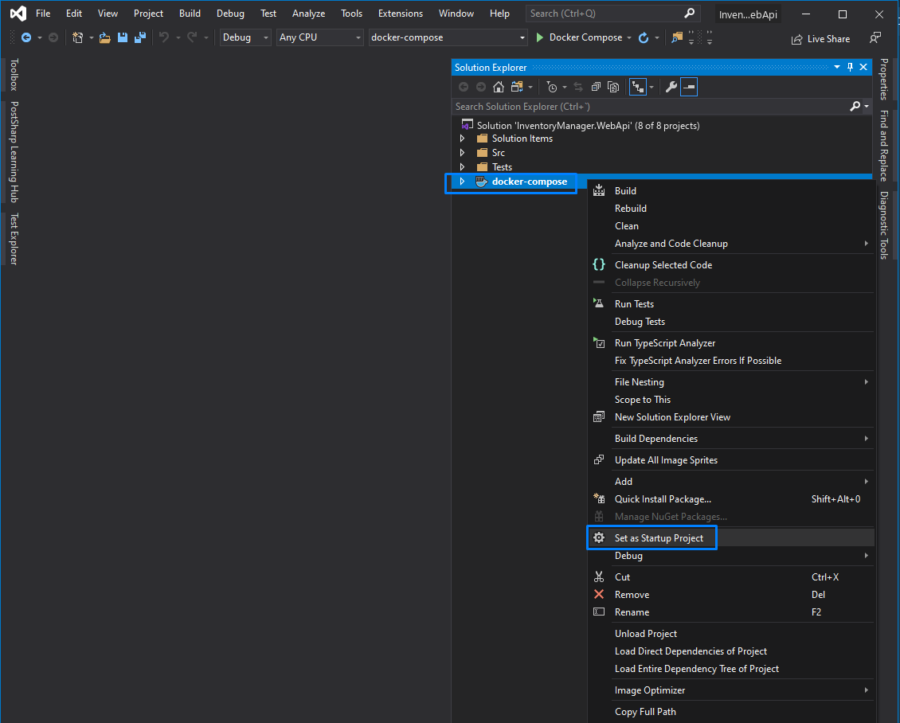

# Inventory Manager API

A REST API for managing inventory items, built as a layered SOA sample in 2020.
It shows a clean separation of concerns, deliberate architectural seams, and a set
of patterns (AutoMapper, MediatR, Hangfire, API versioning, OpenAPI, functional
testing) applied where they earn their place.

Built with Visual Studio 2019 and .NET Core 3.1, and deliberately left there. .NET Core 3.1
went out of support in December 2022, so this is a dated sample and reads as one; what it is
here to show is the architecture and the reasoning behind it, not the framework version.

## Dependencies

- .NET Core 3.1 SDK — to build the solution and run the unit tests.
- Docker with docker-compose — to run the API and the functional tests, which need SQL Server.
- Visual Studio 2019 — optional, and what the walkthrough below uses.

## Getting started

Clone the repository:

```cmd
git clone https://github.com/smaugcoath/inventory-manager-api.git
```

From the command line:

```cmd
docker-compose up --build
dotnet test test/InventoryManager.WebApi.Tests.Unit
```

From Visual Studio:

1. Open the solution.
2. Set the `docker-compose` project as the startup project.
3. Run in Release mode (Ctrl+F5).

Either way the API runs inside a container, with SQL Server alongside it, and the Swagger UI
is served from the root of the site: http://localhost:3340. If that port does not respond, check
the published mapping with `docker ps`. The API container waits for the database service to be
started before it starts itself.

The container listens on HTTP only, so `docker-compose up` needs no certificate setup on any
machine. HTTPS is an opt-in: the compose files still publish 3341 and still mount the folder the
ASP.NET Core development certificate is exported to, but nothing binds an HTTPS endpoint until
`ASPNETCORE_URLS` says so. Visual Studio manages the certificate itself when it launches the
containers; the binding comes from `docker-compose.override.yml` either way. To turn HTTPS on,
export the certificate with
`dotnet dev-certs https -ep %APPDATA%\ASP.NET\Https\InventoryManager.WebApi.Host.pfx -p <password>`
and add to the `webapi` service: `https://+:443` back on `ASPNETCORE_URLS`,
`Kestrel__Certificates__Default__Path=/root/.aspnet/https/InventoryManager.WebApi.Host.pfx`, and
`Kestrel__Certificates__Default__Password`. Add `ASPNETCORE_HTTPS_PORT=3341` as well, or
`UseHttpsRedirection` sends HTTP callers to 443 — the port inside the container, not the one
published on the host.



## Architecture

A REST API whose internal design follows a classic layered SOA. It has three
horizontal service layers and one vertical infrastructure layer:

1. **Data access**, using Entity Framework Core.

   - Project: `InventoryManager.WebApi.Data` (.NET Standard 2.0).
   - Models: the POCO classes that represent the ORM entities.
   - DatabaseContext: the context used to reach the persistence store.
   - Infrastructure: extension methods that register the context with SQL Server as the
     persistence technology. Should the persistence technology change, a new extension
     method can be added to select a different one. Registering the context this way also
     keeps the `DbContext` out of the MVC layer: only the immediately-upper layer
     (Business) is allowed to use it.

2. **Business**, where the domain logic lives.

   - Project: `InventoryManager.WebApi.Business` (.NET Standard 2.0).
   - Models: the business classes. They follow the *Ubiquitous Language* idea and should
     represent concepts that exist in the business vocabulary. If a rule can be resolved
     inside them (self-calculating properties, domain operations, domain events), that is
     where it belongs.
   - Services: everything related to the business services (there is a single one here):
     the interface, the implementation, the notifications, and the exceptions of the
     service that manages inventory-item logic.
   - Mappers: AutoMapper is used to map data-access models to business models. A layer
     must never expose the classes of a lower layer to an upper one.
   - EventHandlers: every service action ends by publishing an internal notification using
     the Mediator pattern. The event handlers are the subscribers to those events: they
     declare themselves by implementing `IMessageHandler<TNotification>`, and the mediator
     registration finds them by scanning this assembly, so adding a subscriber means adding
     a class and nothing else.
     This lets the service do what it has context for (persist data), announce what it did,
     and delegate anything else to external components (publish to a bus or queue, send an
     email, etc.).
     Note: if the application crashes right after persisting but before the notification is
     published, the system is left inconsistent. This is the dual-write problem — two side
     effects that no single transaction covers. A distributed transaction (two-phase commit)
     is one answer, and an expensive one. The cheaper and far more common answer is a
     transactional outbox: write the notification to the database inside the same Unit of
     Work as the state change, and let a separate dispatcher publish it and mark it sent.
     Whatever a crash or a redeploy leaves unsent is still there to be picked up.
   - Infrastructure: as in the data-access layer, it provides business-agnostic extension
     methods for dependency injection. Here the services from the Data layer are registered
     together with the ones used by Business. These registrations are consumed by the upper
     Front layer.

3. **Front**, using the Model-View-Controller pattern.

   This could have been a single Host project, but it is split into two: one with all the
   MVC code and a thin "host" that references it. If the MVC code ever needed to ship as a
   NuGet package and be reused across different hosts, the controllers, configuration, and
   so on would stay internal and the whole thing could be offered as a package without
   exposing implementation details. Hangfire, IdentityServer, and Swagger are examples of
   tools that do exactly this.

   - Project: `InventoryManager.WebApi.Mvc` (.NET Core 3.1).
   - Controllers: the controllers representing each REST resource.
   - Infrastructure: utility methods and extensions that split configuration responsibility
     into smaller, manageable methods, including the registrations of the Business layer.
     It also holds MVC global filters, and could hold serializers, custom binders, etc. A
     key class is `BaseStartup`, an abstract class where all the required services and
     middlewares are registered. It is inherited by the `Startup` of the Host project and by
     the functional tests, so the tests exercise the same configuration as the application
     and that configuration is tested implicitly.
   - Mappers: profiles that convert business-layer objects into public API models.
   - Models: the front-layer models are designed to be extended and to implement well-known
     communication standards. This project uses [json:api](https://jsonapi.org/) — only the
     most basic and necessary parts (the `Data` property), without going into complexities
     such as `Link` for HATEOAS. The models follow the Request/Response pattern familiar from
     APIs such as Amazon Web Services: an action takes a Request and returns a Response, named
     `{ActionName}Request` and `{ActionName}Response`. For a larger API that convention removes
     the need to invent a name for every model, and giving each action its own pair keeps one
     endpoint's schema from becoming an accidental breaking change for another. The GET and
     DELETE endpoints bind their single route parameter directly, since a wrapper model would
     add nothing there; `GetAsyncRequest` and `DeleteAsyncRequest` record the shape those
     requests would take once the endpoints carry more input.

   The Host project simply references the Mvc project, starts the web server, and inherits
   `Startup` from `BaseStartup`.

4. **Infrastructure**: general-purpose services and classes needed across several layers.
   Two services live here: `BackgroundWorkerService` and `MediatorService`. It also holds the
   `ConfigurationApp` class that the `Configuration` section of `appsettings.json` binds to.
   - BackgroundWorkerService: its interface exposes only the single method this API needs.
     Hangfire is used for background and scheduled work — in particular the expiration-date
     job. It also exposes an extension method for its dependency injection. Swapping to a
     different tool later means adding a new implementation and a new registration method.
   - MediatorService: a service for the Mediator pattern, implemented with MediatR (other
     options such as MicroBus exist). It follows the same structure as `BackgroundWorkerService`,
     with its extension methods and possible alternative implementations.

## Design decision: EF Core without a repository layer

There is no repository abstraction wrapping Entity Framework Core. That is a deliberate design
decision, not an omission.

EF Core already implements both patterns. A `DbSet<T>` is the repository, the context's change
tracker together with `SaveChanges` is the Unit of Work, and LINQ is the query language over
them. Wrapping that in a second repository layer costs maintenance and hides capabilities the
business layer legitimately uses — projections, `AsNoTracking`, change tracking — without
buying anything back.

The abstraction only earns its place when the store itself may be swapped for one EF Core
cannot reach. Reaching a store is what a provider does: it translates the expression tree of a
LINQ query into the store's own query language, and turns the context's tracked changes into
writes when `SaveChanges` runs. If a provider exists, the layer above is already portable; the
case for hand-rolled repositories is a move to an ORM or a vendor SDK for which no provider
exists and none is worth writing.

In practice the provider ecosystem reaches well past relational databases. Commercial vendors
such as [CDATA](https://www.cdata.com/drivers/) ship ADO.NET and Entity Framework drivers for
document stores, for services such as Box and Google Drive, and for SaaS APIs such as
MailChimp — using EF less as an ORM than as a uniform seam between the application and an
external service.

## Testing

Ideally each layer would have one project per kind of test it needs: unit, integration,
functional, performance, and so on. This sample ships a focused subset.

`InventoryManager.WebApi.Tests.Unit` covers the pieces where an isolated test is the cheapest
way to pin behaviour down: that the AutoMapper profiles are configured consistently, that an
expiration date is scheduled as a UTC instant rather than drifting with the host's local
offset, and that the mediator registration really does discover its handlers and resolve their
scoped dependencies. Further unit tests could check the `IOptions` binding and any method with
real algorithmic complexity, and controller actions could be exercised with mocked services
(Moq, for instance) asserting status codes and results. For an API, though, functional tests
usually earn more: with CI tooling that can spin up containers for persistence, storage
emulators, FTP servers, buses, and even Spark clusters, a good set of functional tests driving
the API through .NET's `TestServer` gives broader coverage and less code to maintain than a
large body of unit tests.

`InventoryManager.WebApi.Mvc.Tests.Functional`, using xUnit, FluentAssertions, and
`TestServer`, is where several tests and theories per endpoint would live, checking that the
HTTP status codes, response bodies, headers, and other metadata are correct. It is also a
good place to query persistence through the services and assert that the stored state is
what it should be. It currently covers creation — the 201 with its Location header, and the
409 on a duplicate name. The tests run on the host, against the SQL Server container that
`docker-compose` publishes on `localhost:1433`, so bring the containers up first and then run
`dotnet test test/InventoryManager.WebApi.Mvc.Tests.Functional`. The unit tests need nothing
but the SDK.

Functional tests still worth adding:

- DELETE
  - Return 200 with the deleted item.
  - Return 404 if the input is not found in the database.
  - Return 400 if the input is invalid (null, empty, or longer than 100 chars).
- GET
  - Return 200 with the requested item.
  - Return 404 if the input is not found in the database.
  - Return 400 if the input is invalid (null, empty, or longer than 100 chars).
- POST
  - Return 400 if the input parameters are invalid.

### Why the tests are not parallelized

Although xUnit is built to run tests in parallel, the functional tests here depend on an
external SQL container (and would need more containers if the background worker and mediator
used persistence). They all share the same database, so parallel runs would conflict as more
endpoints are added. Parallelizing would mean a database — or a SQL container — per test,
which is far more expensive in time.

The chosen approach uses [Respawn](https://github.com/jbogard/Respawn) to reset the database
between tests: it clears every table except the ones its checkpoint is told to ignore, which
here is the migrations history. So even though the tests run synchronously, each one gains
speed and isolation, since clearing the tables is much cheaper than recreating the whole
database and applying migrations.

## Notes on the design

### Migrations

Every time the application starts under docker-compose, the Data layer drops and recreates the
schema. That keeps a container run starting from the same known state, which is what makes the
sample easy to pick up, and it is why no initial migration is checked in. To generate one:

```cmd
dotnet ef migrations add Initial <parameters for where the models and context live>
```

A real deployment would replace that with migrations applied as a release step, once the rest
of the resources are up, and would move them out of dependency-injection registration into an
explicit startup task. Migrations also give a way back: `dotnet ef database update <previous>`
runs the `Down` methods to return persistence to an earlier state.

### Item type

The item-type property is modelled as a `byte`. Such types tend to be fairly static, so an
enum is usually the right fit. One option is a single enum in the infrastructure layer to be
reused. If each database item carried a constraint — for instance being a foreign key of
another table — it would be worth splitting into two enums so as not to expose persistence
IDs to the outside: one for the EF entity and one for the rest of the application, with the
value translation handled in the Business-to-Data mappers.

### In-memory services and their trade-offs

Development started on an in-memory database, but the final choice was the Visual Studio
multi-container solution: the database is deployed alongside the Web API. Some services still
work in memory, and it is worth knowing the implications:

- **Hangfire**: without persistence, if the application stops, scheduled jobs (such as the
  expiration-date job) and any unfinished background work are lost. A production setup would
  add a store (Redis, MongoDB, SQL, etc.) to keep Hangfire state. The background-job dashboard
  is available at the relative path `/Hangfire`.
- **Mediator**: likewise. The way out of the dual-write problem described above is to persist
  the publication state alongside the object in the same transaction — published or not — and
  dispatch from there. Event Sourcing offers another route: record, on each state change,
  whether the corresponding event was published.

### Possible extensions

- **Event Sourcing and CQRS**: every interaction with the system would be a Query, a Command,
  or an Event. Event Sourcing would also give a full history of the states each aggregate went
  through, and allow periodic snapshots. This is more robust when the future use of the data is
  uncertain — it enables historical reporting, training ML models, and so on.
- **CI/CD**: no CI/CD definitions are included. A reasonable order would be:

  **Continuous Integration**
  1. Install the dependencies on the CI agent.
  2. Restore packages and build every project involved in the artifact.
  3. Run the tests in the defined order (unit first, then integration, then functional; fail
     fast when a faster stage breaks).
  4. Call other tooling: generate documentation artifacts (HTML, Markdown), run audits such as
     SonarCloud, etc.
  5. If NuGet packages are needed, run `dotnet pack` for the prerelease (and release) versions.
  6. Publish the artifact and trigger the deploy.

  **Continuous Deployment**
  1. Install the dependencies on the deployment agent.
  2. Fetch the previously built binaries.
  3. Publish every resource to the target services:
     - Web API to an App Service / Azure Function / AKS / ACI.
     - Documentation to blob storage + CDN, or a wiki.
     - NuGet packages per environment (prerelease in Dev, Release in Prod).
  4. Publish the results of the process, audit documents, etc.

  Test stages can be parallelized across CI/CD stages (for example, Azure DevOps multi-stage
  pipelines) to shave time off the build. Smoke tests would need the artifact already deployed,
  so they are out of scope for the pipeline above.

## License

Released under the [MIT License](./LICENSE).
